#### Questão 2, item a
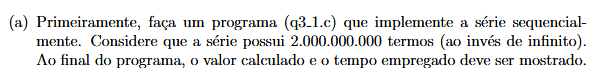
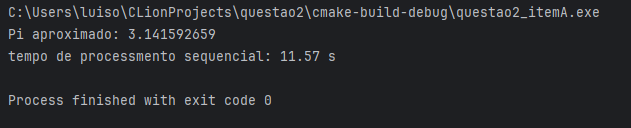

##### item f
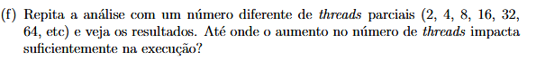

2 : P 6.13s T.T 12.24s

4 : P 3.35s T.T 13.28s

8 : P 2.11s T.T 16.48s

16 : P 2.03s T.T 29.69s

32 : P 2.17s T.T 32.11s

64 : P 2.40s T.T 23.78s

128 : P 2.25s T.T 26.49s

256 : P 2.60s T.T 20.17s

512 : P 3.33s T.T 21.64s

1024 : P 4.45s T.T 19.48s

3000 : P 10.03s T.T 18.99s

6000 : P 17.59s T.T 19.66s

##### 2 threads
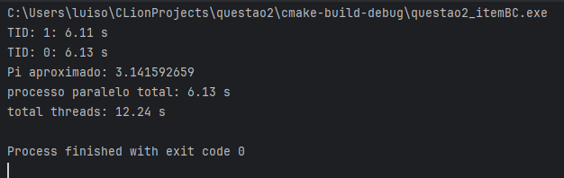

##### 4 threads
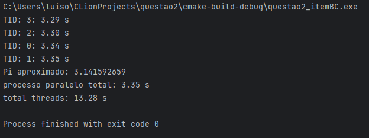

##### 8 threads
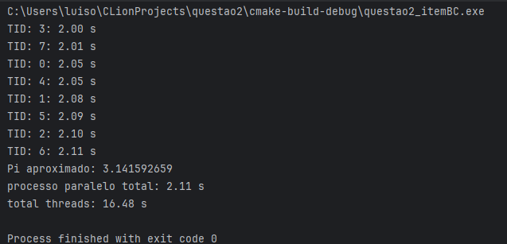

##### 16 threads
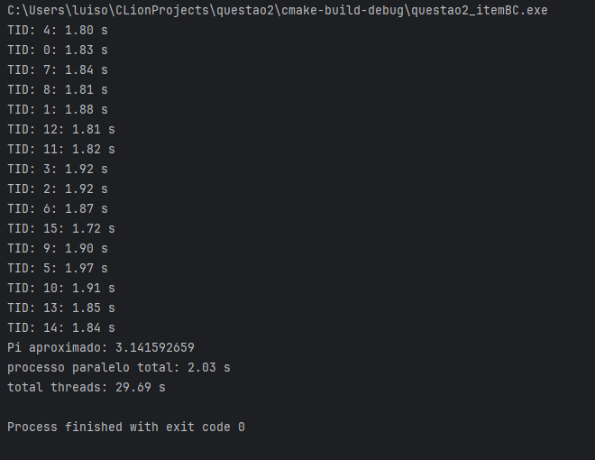

##### 32 threads
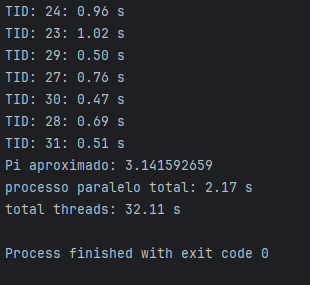

##### 64 threads
#### No inicio deu um deley antes de exibir a primeira tid
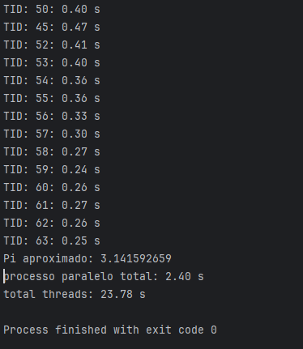

##### 128 threads
#### as primeiras tids foram exibidas com delay
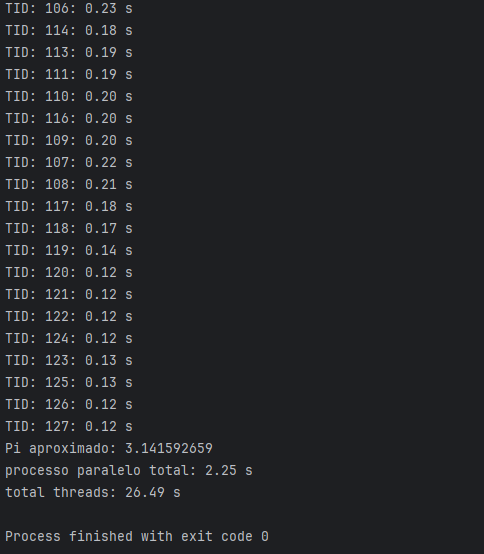

##### 256 threads
#### mesmo comportamento das anteriores

##### 512 threads
#### mais delay
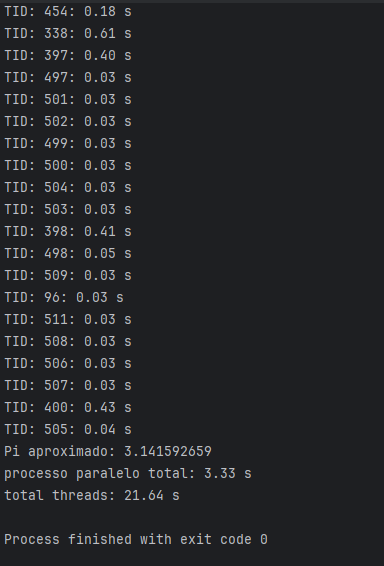

##### 1024 threads
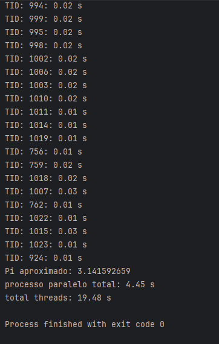

##### 3000 threads
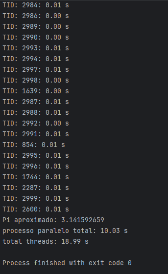

##### 6000 threads
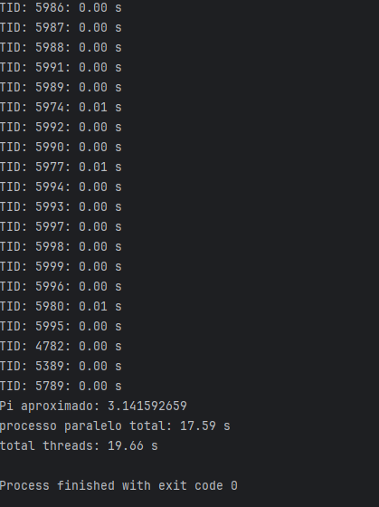
